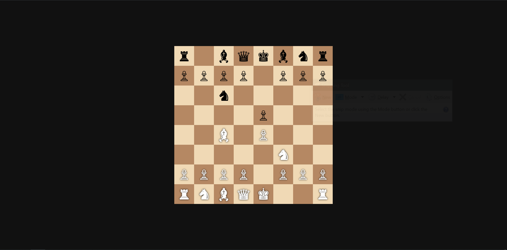
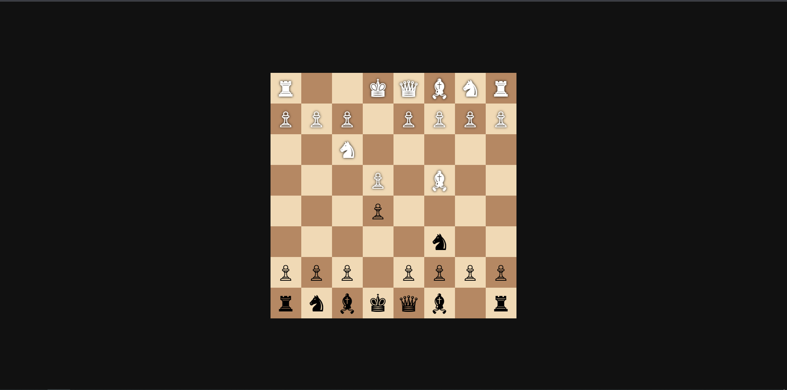

# 🎯 ChessVision


## 📖 Description

A modern, full-stack chess application built with React and Node.js, featuring real-time multiplayer gameplay, interactive chessboard with drag-and-drop functionality, and Socket.IO-powered live game sessions. This project combines the classic game of chess with modern web technologies to deliver an engaging gaming experience.

**🚀 Key Technologies:** JavaScript, React, Vite, ESLint, Node.js, Express.js, Socket.IO, Chess.js, EJS

## 🔗 Links

- [🌐 Demo](https://github.com/H0NEYP0T-466/ChessVision) 
- [📚 Documentation](https://github.com/H0NEYP0T-466/ChessVision#readme)
- [🐛 Issues](https://github.com/H0NEYP0T-466/ChessVision/issues)
- [🤝 Contributing](https://github.com/H0NEYP0T-466/ChessVision/blob/main/CONTRIBUTING.md)

---

## 📑 Table of Contents

- [📖 Description](#-description)
- [🔗 Links](#-links)
- [⚡ Installation](#-installation)
- [🎮 Usage](#-usage)
- [✨ Features](#-features)
- [🛠️ Built With](#️-built-with)
- [📂 Folder Structure](#-folder-structure)
- [🤝 Contributing](#-contributing)
- [📄 License](#-license)
- [🗺️ Roadmap](#️-roadmap)
- [🙏 Acknowledgements](#-acknowledgements)

---

## ⚡ Installation

### Prerequisites
- Node.js (v14 or higher)
- npm or yarn package manager

### Quick Start

1. **Clone the repository**
   ```bash
   git clone https://github.com/H0NEYP0T-466/ChessVision.git
   cd ChessVision
   ```

2. **Install frontend dependencies**
   ```bash
   npm install
   ```

3. **Install backend dependencies**
   ```bash
   cd backend
   npm install
   cd ..
   ```

4. **Start the development servers**

   **Frontend (in one terminal):**
   ```bash
   npm run dev
   ```

   **Backend (in another terminal):**
   ```bash
   cd backend
   node index.js
   ```


---

## 🎮 Usage

### 💻 Example Commands
```bash
# Development mode
npm run dev

# Build for production
npm run build

# Lint the code
npm run lint

# Preview production build
npm run preview
```

### 🚀 Development Workflow
```bash
# Start the application in development mode
npm run dev
```

---

## ✨ Features

🎯 **Core Features:**
- 🚀 **Modern Architecture** - Built with cutting-edge technologies
- 🎨 **Interactive Interface** - Responsive and user-friendly design
- ⚡ **Real-time Updates** - Live functionality and instant feedback
- 🎮 **Enhanced User Experience** - Smooth and engaging interactions
- 🏁 **Robust Functionality** - Complete feature set with validation

🔧 **Technical Features:**
- 📱 **Responsive Design** - Works seamlessly across all devices
- 🚀 **Modern Tech Stack** - Built with JavaScript, React, Vite and 6 more
- ♻️ **Hot Module Replacement** - Fast development with instant updates
- 🎯 **Code Quality** - ESLint configuration and best practices
- 🎨 **Custom Styling** - Beautiful, modern UI with custom CSS

---

<div align="center">
  
  
  <p><em>Live game state from both players' perspectives</em></p>
</div>

## 🛠️ Built With


#### Languages


#### Frameworks
  

#### Tools
 

#### Libraries
  


---

## 📂 Folder Structure

```
ChessVision/
📁 backend/
│   ├── 📁 public/
│   │   └── 📁 js/
│   │   │   └── ⚡ chessgame.js
│   ├── 📁 views/
│   │   └── 📄 app.ejs
│   ├── ⚡ index.js
│   ├── ⚙️ package-lock.json
│   └── ⚙️ package.json
📁 public/
│   └── 📄 vite.svg
📁 scripts/
│   └── 📄 generate-readme.cjs
📁 src/
│   ├── 📁 assets/
│   │   └── 📄 react.svg
│   ├── 🎨 App.css
│   ├── ⚡ App.jsx
│   ├── 🎨 index.css
│   └── ⚡ main.jsx
📖 CONTRIBUTING.md
⚡ eslint.config.js
📄 index.html
📄 LICENSE
⚙️ package-lock.json
⚙️ package.json
📖 README.md
⚡ vite.config.js
```

---

## 🤝 Contributing

We welcome contributions from the community! Whether you're fixing bugs, adding features, or improving documentation, your help is appreciated.

### How to Contribute

1. **Fork the repository**
   ```bash
   # Click the "Fork" button on GitHub or use CLI
   gh repo fork H0NEYP0T-466/ChessVision
   ```

2. **Clone your fork**
   ```bash
   git clone https://github.com/YOUR-USERNAME/ChessVision.git
   cd ChessVision
   ```

3. **Create a feature branch**
   ```bash
   git checkout -b feature/amazing-feature
   ```

4. **Make your changes**
   - Follow the existing code style
   - Add tests if applicable
   - Update documentation as needed

5. **Commit your changes**
   ```bash
   git commit -m "Add amazing feature"
   ```

6. **Push to your fork**
   ```bash
   git push origin feature/amazing-feature
   ```

7. **Open a Pull Request**
   - Provide a clear description of your changes
   - Reference any related issues
   - Ensure all tests pass

### Development Guidelines
- Use meaningful commit messages
- Follow the existing code style
- Test your changes thoroughly
- Update documentation for new features

### Reporting Issues
Found a bug or have a feature request? Please [open an issue](https://github.com/H0NEYP0T-466/ChessVision/issues) with:
- Clear description of the problem/feature
- Steps to reproduce (for bugs)
- Expected vs actual behavior
- Your environment details

---

## 📄 License

This project is licensed under the MIT License - see the [LICENSE](LICENSE) file for details.

```
MIT License

Copyright (c) 2025 ChessVision Team

Permission is hereby granted, free of charge, to any person obtaining a copy
of this software and associated documentation files (the "Software"), to deal
in the Software without restriction, including without limitation the rights
to use, copy, modify, merge, publish, distribute, sublicense, and/or sell
copies of the Software, and to permit persons to whom the Software is
furnished to do so, subject to the following conditions:

The above copyright notice and this permission notice shall be included in all
copies or substantial portions of the Software.

THE SOFTWARE IS PROVIDED "AS IS", WITHOUT WARRANTY OF ANY KIND, EXPRESS OR
IMPLIED, INCLUDING BUT NOT LIMITED TO THE WARRANTIES OF MERCHANTABILITY,
FITNESS FOR A PARTICULAR PURPOSE AND NONINFRINGEMENT. IN NO EVENT SHALL THE
AUTHORS OR COPYRIGHT HOLDERS BE LIABLE FOR ANY CLAIM, DAMAGES OR OTHER
LIABILITY, WHETHER IN AN ACTION OF CONTRACT, TORT OR OTHERWISE, ARISING FROM,
OUT OF OR IN CONNECTION WITH THE SOFTWARE OR THE USE OR OTHER DEALINGS IN THE
SOFTWARE.
```

---

## 🗺️ Roadmap

### 🚀 Current Version (v1.0)
- [x] Core functionality implemented
- [x] Basic user interface
- [x] Essential features working
- [x] Documentation completed

### 🎯 Upcoming Features (v2.0)
- [ ] **Enhanced Features** - Additional functionality and improvements
- [ ] **User Experience** - Better interface and user interactions
- [ ] **Performance** - Optimization and speed improvements
- [ ] **Testing** - Comprehensive test coverage
- [ ] **Documentation** - Expanded guides and tutorials

### 🔮 Future Vision (v3.0+)
- [ ] **Advanced Features** - Cutting-edge functionality
- [ ] **Integration** - Third-party service connections
- [ ] **Scalability** - Enhanced performance and capacity
- [ ] **Mobile Support** - Native mobile applications
- [ ] **Analytics** - Usage tracking and insights

---

## 🙏 Acknowledgements

### Libraries & Frameworks
- 🔥 **JavaScript** - High-level programming language for web development
- 🔥 **[React](https://reactjs.org/)** - A JavaScript library for building user interfaces
- 🔥 **[Vite](https://vitejs.dev/)** - Next generation frontend tooling
- 🔥 **[ESLint](https://eslint.org/)** - Pluggable JavaScript linter for identifying and reporting patterns
- 🔥 **[Node.js](https://nodejs.org/)** - JavaScript runtime built on Chrome's V8 JavaScript engine
- 🔥 **[Express.js](https://expressjs.com/)** - Fast, unopinionated web framework for Node.js
- 🔥 **[Socket.IO](https://socket.io/)** - Real-time bidirectional event-based communication
- 🔥 **[Chess.js](https://github.com/jhlywa/chess.js)** - JavaScript chess library for chess move generation/validation
- 🔥 **[EJS](https://ejs.co/)** - Embedded JavaScript templating engine

### Special Thanks
- Contributors who help improve this project
- The open-source community for inspiration and support
- Users who provide feedback and testing

---

<div align="center">

**🎯 Ready to get started?**

[⭐ Star this repo](https://github.com/H0NEYP0T-466/ChessVision) • [🐛 Report Bug](https://github.com/H0NEYP0T-466/ChessVision/issues) • [💡 Request Feature](https://github.com/H0NEYP0T-466/ChessVision/issues)

**Made with ❤️ by H0NEYP0T-466**

</div>
